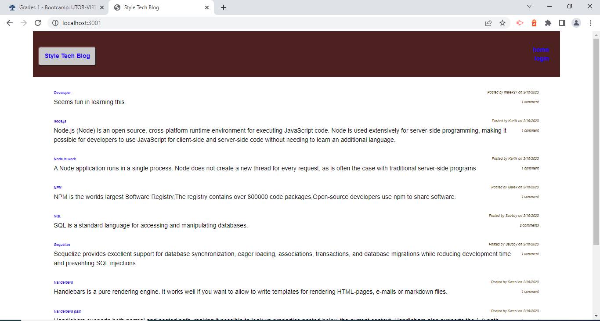
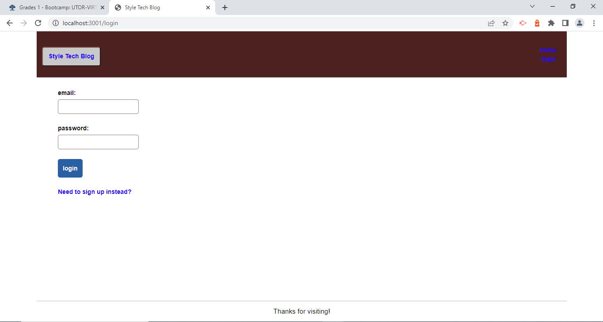
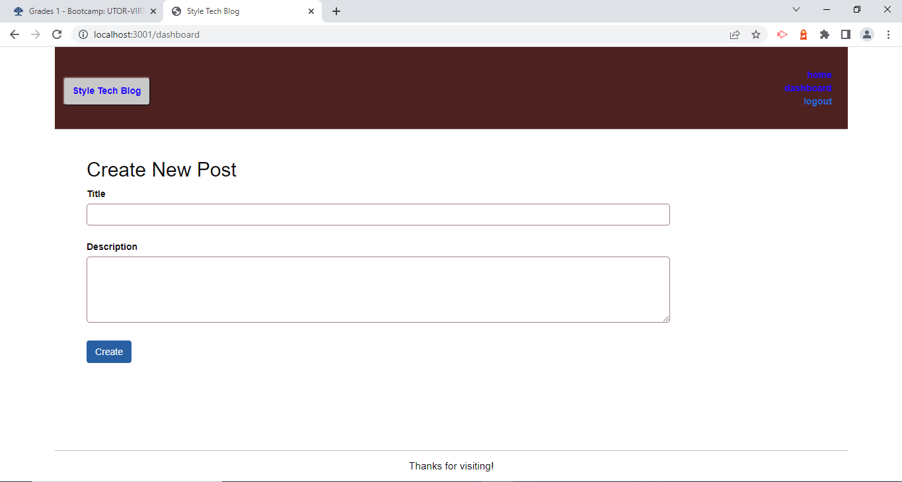
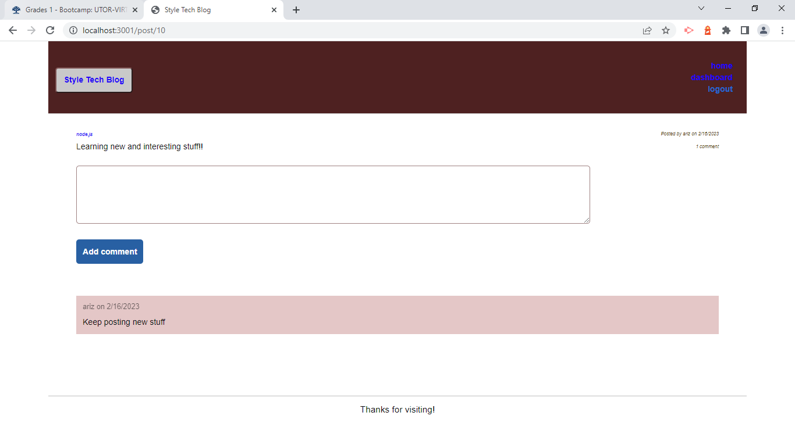

# Style Tech Blog

## Description
This is a basic CMS-style blog site that was created using the Model, View, Controller paradigm.
This application was created using Node.js, express for the server, and sequelize to connect to a mysql database entitled "styletechblog_db".  All user, post, and comment data is stored in tech_blog_db.  The live app is currently deployed on Heroku, using the JAWSDB add on to store data.  All passwords have been encrypted using the bcrypt Node.js package.  The HTML views templates are generated using Handlebars.js.

## Tools Used to Create This Project

* JavaScript ES6
* Node.js
* Express.js
* dotenv (npm package used to store environmental variables used in a project locally so sensitive data like root passwords are not exposed on GitHub)
* MySQL
* Sequelize (npm package for integrating MySQL and Node.js)
* bcrypt (npm package for password hashing)
* handlebars (npm package for a template engine used for html and javascript integration on the front-end)
* Heroku (hosting platform)
  * JawsDB (a Heroku add-on for hosting the MySQL database)

Here are some screenshots to demonstrate the functionality and show how the page is rendered.

Homepage Logged out:

Logged In:

Dashboard:

Single Post with Comments:

Edit Post:

## Usage
The application is deployed on Heroku at https://styletechblog.herokuapp.com/

Visit the website on Heroku. You can view posts and visit links as a visitor, create your own account, and as an authenticated user you can add your own posts and comment on other posts as well. You can edit titles and content or delete your own posts as well. You can also update your username, email, and password.

Warning: New data is stored on Heroku for an indeterminate period of time. At least once a day the dynos will be restarted and any new data included new users might be wiped out.

## Deployment

https://github.com/saubby/Style-tech_blog

https://styletechblog.herokuapp.com/
